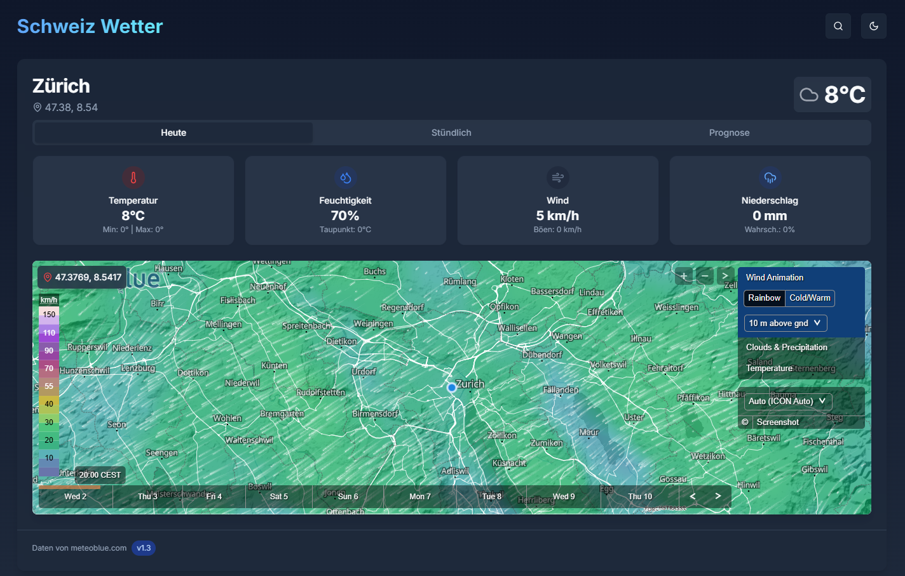
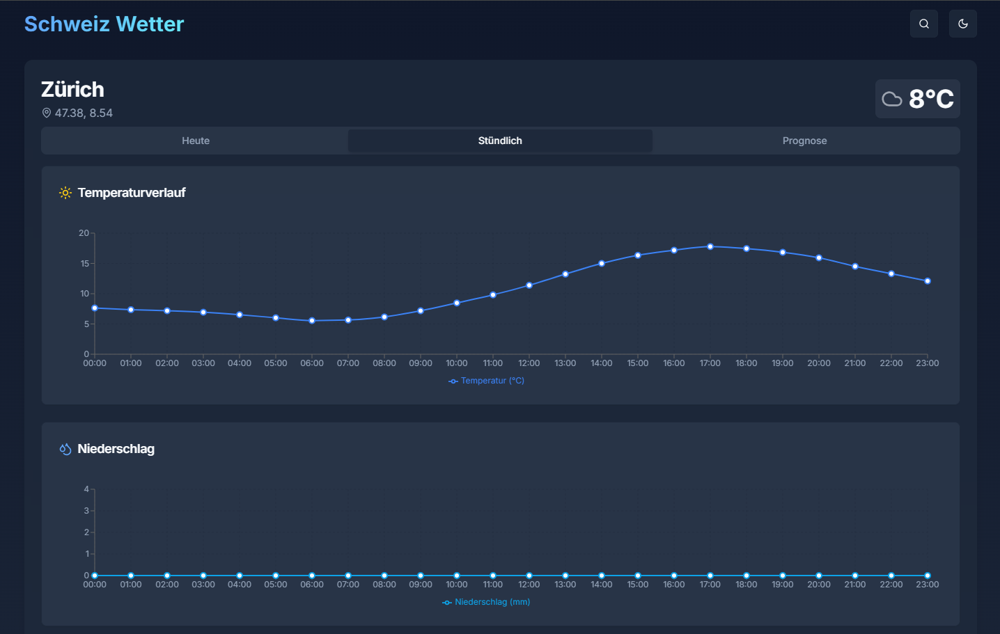
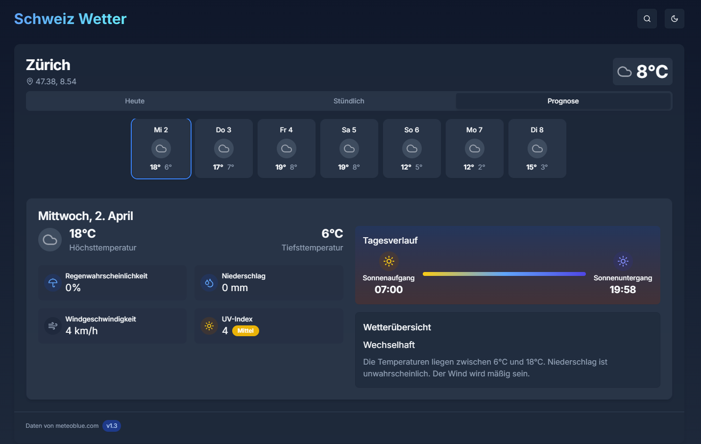

# Swiss Weather

Swiss Weather is a modern weather application built with **Next.js**, **TypeScript**, and **Tailwind CSS**. It provides real-time weather updates, hourly trends, and a 7-day forecast for any location in Switzerland. The application features a sleek, responsive design with both light and dark modes for an optimal user experience.

## 🚀 Technologies Used

- **Next.js** – A powerful React framework for fast, server-rendered applications.
- **TypeScript** – A strongly typed programming language that builds on JavaScript.
- **Tailwind CSS** – A utility-first CSS framework for responsive and stylish UI.

## 🛠 Installation & Setup

### ⚠️ API Key Setup
Before running the application, you need to set up your API key. 
- Open `app/api/weather/route.ts` and navigate to **line 10**.
- Replace the existing API key with your own from [Meteoblue](https://my.meteoblue.com/).
- You can get a free API key by signing up on their website.


To run Swiss Weather locally, follow these steps:

1. Clone the repository:

   ```bash
   git clone https://github.com/your-username/swiss-weather.git
   cd swiss-weather
   ```

2. Install dependencies:

   ```bash
   yarn install
   ```

3. Start the development server:

   ```bash
   yarn dev
   ```

4. Open your browser and go to `http://localhost:3000`.

## 🌦 Features

### 📌 Current Weather

- **Live Temperature:** Displays the current temperature with high and low values.
- **Humidity & Dew Point:** Provides real-time humidity levels and dew point.
- **Wind Conditions:** Shows wind speed and gusts.
- **Precipitation Probability:** Indicates the chance of rain or snow.
- **Dynamic Backgrounds:** The UI changes based on weather conditions.



### 📊 Hourly Forecast

- **Temperature Trend:** Hourly updates on temperature variations.
- **Precipitation Levels:** Predicts rain or snowfall for each hour.
- **Wind Speed Changes:** Displays variations in wind speed throughout the day.



### 📅 7-Day Weather Forecast

- **Daily Max & Min Temperatures:** Overview of expected temperature ranges.
- **Precipitation Probability:** Displays the likelihood of rain or snow.
- **UV Index & Wind Speed:** Helps users prepare for outdoor activities.
- **Sunrise & Sunset Times:** Provides accurate solar event timings.



### 🔍 Search Functionality

- **Find any Swiss location** to get real-time weather updates.
- Uses **postal codes** for precise searches.

### 🌙 Dark & Light Mode

- Toggle between themes for a comfortable viewing experience.

## 📡 Data Sources

Swiss Weather fetches data from reliable APIs:

- 🌍 [OpenPLZ API](https://openplzapi.org/) – Location-based postal code lookup.
- ☀️ [Sunrise-Sunset API](https://api.sunrise-sunset.org/) – Sunrise and sunset times.
- 🌦 [Meteoblue API](https://my.meteoblue.com) – Comprehensive weather forecasts.

## 📜 License

This project is open-source and available under the MIT License.

---

**Developed with ❤️ using Next.js, TypeScript, and Tailwind CSS**

